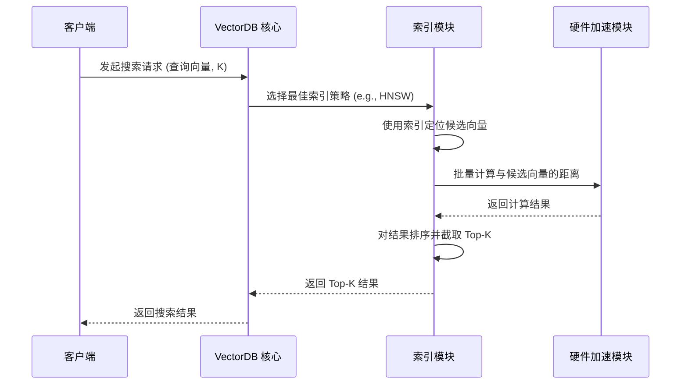
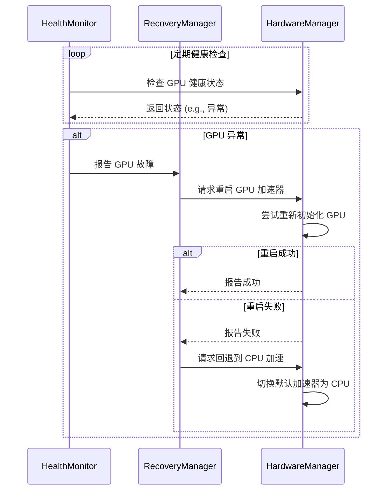

# VectorSphere 数据库算法与硬件加速分析

本文档旨在分析 VectorSphere 数据库的核心算法逻辑以及其硬件加速能力，并提供相应的架构设计和逻辑流程图。

## 1. 核心算法逻辑

VectorSphere 作为一个向量数据库，其核心功能是高效地存储和检索高维向量。这主要依赖于多种近似最近邻（ANN）搜索算法的实现。以下是项目中的主要算法：

- **暴力搜索 (Brute-Force)**: 这是最基础的搜索方法，通过计算查询向量与数据库中所有向量的距离来找到最近邻。虽然精确度最高，但效率最低，适用于小规模数据集。

- **IVF (Inverted File)**: 倒排文件索引。通过将向量空间划分为多个聚类（cluster），搜索时只需在查询向量最接近的几个聚类中进行，从而大大减少了搜索范围。项目中实现了 `StrategyIVF` 和 `StrategyEnhancedIVF` 两种策略。

- **HNSW (Hierarchical Navigable Small World)**: 一种基于图的 ANN 算法。它构建了一个层次化的图结构，使得搜索可以从顶层稀疏的图快速导航到底层密集的图，从而实现高效和高精度的搜索。项目中通过 `StrategyHNSW` 实现。

- **PQ (Product Quantization)**: 乘积量化。一种向量压缩技术，将高维向量分解为多个低维子向量并分别进行量化，从而显著降低内存占用。通常与 IVF 等其他索引结构结合使用。项目中通过 `StrategyPQ` 实现。

- **LSH (Locality-Sensitive Hashing)**: 局部敏感哈希。通过一系列哈希函数将相似的向量映射到同一个桶中，从而在搜索时只需检查少数几个桶。项目中实现了 `StrategyEnhancedLSH`。

- **混合策略 (Hybrid)**: 结合多种索引和搜索技术，例如 `StrategyHybrid` 和 `StrategyIVFHNSW`，以期在不同场景下达到最佳的性能和精度平衡。

### 1.1 索引预热 (`WarmupIndex`)

为了在服务启动后能立即提供高性能的搜索，项目实现了索引预热机制。`WarmupIndex` 函数会针对所有已启用的索引类型（如 IVF, HNSW, PQ, LSH 等）和计算策略（如 AVX2, AVX512, GPU）执行一系列样本查询。这会将索引数据和计算核心加载到内存或缓存中，避免首次查询时的冷启动延迟。

## 2. 硬件加速能力

VectorSphere 的一个显著特点是其对硬件加速的深度集成，这体现在 `src/library/acceler` 目录下的代码中。系统能够自动检测并利用多种硬件资源来加速向量计算。

- **CPU 加速**: 利用现代 CPU 的 SIMD（单指令多数据流）指令集，如 `AVX2` 和 `AVX512`，来并行计算向量间的距离，显著提升了在 CPU 上的计算性能。

- **GPU 加速**: 通过 `StrategyGPU`，系统可以将大量的距离计算任务卸载到 GPU 上并行处理。GPU 拥有数千个核心，非常适合处理此类大规模并行计算任务。

- **FPGA/ASIC 加速**: 项目中还包含了对 FPGA（现场可编程门阵列）和 ASIC（专用集成电路）的支持，虽然这部分更偏向于专用硬件，但展示了系统架构的可扩展性。

- **其他硬件**: 还包括了对持久内存（PMem）和 RDMA（远程直接内存访问）的支持，旨在优化数据存储和节点间通信的效率。

### 2.1 硬件管理器 (`HardwareManager`)

`HardwareManager` 是硬件加速功能的核心，它负责：
- **注册与管理**: 统一管理所有可用的硬件加速器（CPU, GPU, FPGA 等）。
- **健康监控**: `HealthMonitor` 定期检查每个加速器的状态，如可用性、错误率、响应时间等。
- **故障恢复**: `RecoveryManager` 在检测到硬件故障时，能够自动尝试重启或回退到其他可用的加速器，保证服务的稳定性。

## 3. 架构设计

以下是 VectorSphere 的高层架构设计图，展示了其主要组件和它们之间的交互。

```mermaid
graph TD
    A[客户端] --> B{API 网关}
    B --> C[VectorDB 核心]

    subgraph VectorDB 核心
        C --> D{查询解析器}
        D --> E{索引与搜索模块}
        E --> F[数据存储]
        E --> G{硬件加速模块}
    end

    subgraph 硬件加速模块
        G --> H[HardwareManager]
        H --> I[CPU (AVX)]
        H --> J[GPU (CUDA)]
        H --> K[FPGA]
        H --> L[其他硬件]
        H --> M[HealthMonitor]
        H --> N[RecoveryManager]
    end

    F --> O[内存]
    F --> P[持久化存储 (SSD/PMem)]
```

## 4. 逻辑流程图

### 4.1 向量搜索流程

下图展示了一次典型的向量搜索请求的处理流程。



### 4.2 硬件故障恢复流程

下图展示了当 `HealthMonitor` 检测到硬件故障时的自动恢复流程。

